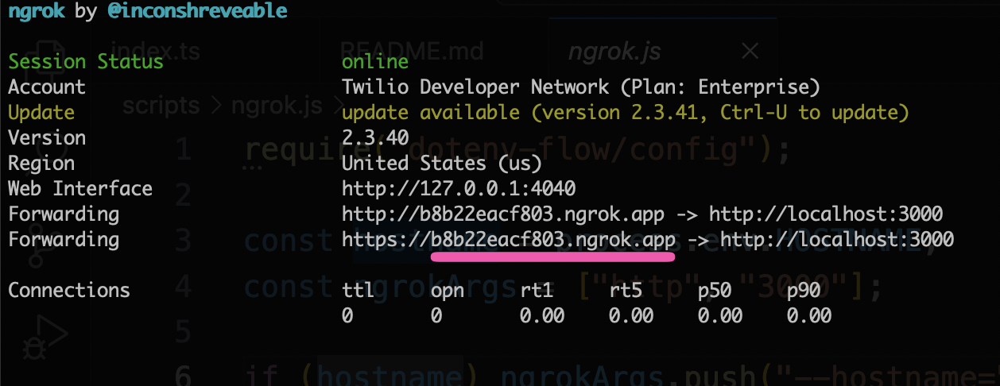

# Minimalist Voice Bot with Plivo & XAI Realtime

> **IMPORTANT DISCLAIMER**  
> **These are example implementations for learning and development purposes only.**  
> **NOT PRODUCTION-READY WITHOUT ADDITIONAL HARDENING.**  

This project demonstrates how to integrate [Plivo's Audio Streaming](https://plivo.com/docs/voice-agents/audio-streaming/overview) with XAI's real-time streaming API to enable real-time voice agents. Users can make voice calls via Plivo and the system proxies the audio with XAI's Realtime API.

## How it Works

- The `/answer` endpoint responds to Plivo's Answer URL with a [`<Stream/>`](https://plivo.com/docs/voice-agents/audio-streaming/concepts/audio-streaming-guide) element (`bidirectional`, `keepCallAlive`, `contentType="audio/x-mulaw;rate=8000"`).
- Plivo opens a WebSocket and sends `start` / `media` / `dtmf` events ([protocol reference](https://plivo.com/docs/voice-agents/audio-streaming/concepts/audio-streaming-reference)).
- Caller audio is forwarded to XAI Realtime as `audio/pcmu` (mu-law 8 kHz) with no transcoding.
- XAI mu-law deltas are sent back to Plivo via `playAudio`; barge-in uses `clearAudio`.

## Get Started

### 0. Prerequisites

- [Plivo account](https://console.plivo.com/) with a [phone number](https://console.plivo.com/phone-numbers/)
- [XAI Platform Account](https://accounts.x.ai/sign-up?redirect=grok-com) and `XAI_API_KEY`
- [nGrok installed globally](https://ngrok.com/docs/getting-started/)

### 1. Clone Repo

```bash
# Clone the repository
git clone <your-repo-url>
cd voice-examples/agent/telephony/xai/plivo
```

### 2. Install Dependencies

```bash
npm install
```

### 3. Start Ngrok Tunnel

The application needs to know the domain (`HOSTNAME`) it is deployed to in order to function correctly. This domain is set in the `HOSTNAME` environment variable and it must be configured before starting the app.

Start ngrok by running this command.

```bash
ngrok http 3000
```

Then copy the domain



_Note: ngrok provides [static domains for all ngrok users](https://ngrok.com/blog-post/free-static-domains-ngrok-users). You can avoid updating the `HOSTNAME` every time by provisioning your own static domain._

### 4. Add Environment Variables

```bash
XAI_API_KEY=your-xai-api-key
```

```bash
HOSTNAME=your-ngrok-domain.ngrok.app
```

### 5. Run the App

This command will start the Express server which handles incoming Plivo webhook requests and media streams.

```bash
npm run dev
```

### 6. Configure Plivo Application Webhooks

On startup, if Plivo credentials and `HOSTNAME` are set (and `AUTO_PROVISION` is not `false`), the server creates or updates a [Plivo Application](https://plivo.com/docs/account/api/application) and optionally attaches `PLIVO_PHONE_NUMBER`.

You can also configure manually in the [Plivo Console](https://console.plivo.com/):

- <b>Answer URL</b>: `POST` `https://your-ngrok-domain.ngrok.app/answer`
- <b>Hangup URL</b>: `POST` `https://your-ngrok-domain.ngrok.app/hangup`

### 7. Place a Call to Your Plivo Phone Number

You're all set. Place a call to your Plivo Phone Number and you should see the real-time transcript logged to your local terminal.

## Outbound Calls

This example also supports making outbound calls where the AI agent initiates the conversation.

### Additional Environment Variables for Outbound Calls

Add these to your `.env` file:

```bash
# Plivo credentials for outbound calls
PLIVO_AUTH_ID=your-plivo-auth-id
PLIVO_AUTH_TOKEN=your-plivo-auth-token
PLIVO_PHONE_NUMBER=+1234567890  # Your Plivo phone number

# The phone number to call
TARGET_PHONE_NUMBER=+1234567890
```

### Making an Outbound Call

With the server running (`npm run dev`), open a new terminal and run:

```bash
npm run outbound
```

This will:
1. Initiate a call from your Plivo phone number to the target phone number
2. Connect the call to the XAI voice agent
3. The agent will speak first, introducing itself and explaining the Grok Voice Agent API

The agent is configured to proactively start the conversation since it's making an outbound call.

## Tools

| Tool | Description |
| --- | --- |
| `end_call` | Hangs up the active Plivo call via the Calls API |
| `generate_random_number` | Demo tool that returns a random integer in a range |

## Audio Format

| Hop | Format |
| --- | --- |
| Plivo <-> Server | `audio/x-mulaw` @ 8 kHz (base64), `media` / `playAudio` |
| Server <-> XAI | `audio/pcmu` — same bytes, no resampling |

## Documentation

- [Plivo Audio Streaming Guide](https://plivo.com/docs/voice-agents/audio-streaming/concepts/audio-streaming-guide)
- [Plivo Audio Streaming Protocol Reference](https://plivo.com/docs/voice-agents/audio-streaming/concepts/audio-streaming-reference)
- [Plivo Application API](https://plivo.com/docs/account/api/application)
- [XAI API Docs](https://x.ai/api)
